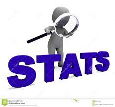

 <a href="https://www.linkedin.com/in/syed-hassan-ul-haq-851446247" target="_blank">

<p align="center"> 
   Visitor count:
   
    
 

 

#   About Me:

- Hello🤍, my name is <a href="https://www.linkedin.com/in/syed-hassan-ul-haq-851446247/" target="blank">Syed Hassan ul-haq,👨‍💻</a> and I'm a student at UIT studying Computer Science. Python🐍 is my favourite programming Language and Chisel/Scala are my favourite HDLs, and I love solving issues. One of the areas where I gained the most knowledge was GitHub. Aim to contribute to the developer community and the opensource world.
------
 🌱 I’m currently learning Web Deveopment through Django and JavaScript 💬 Ask me about Python, RV32I & Chisel, Scala, Github and Memes 👨🏼‍💻 Tech Geek, always ready to learn new Technologies/Frameworks/Languages. 

##  Socials:

 

##  Tech Stack:

|Stats |Streak |Languages 
|---|---|---|
|||[|

---

## 🏆 GitHub Trophies

---
